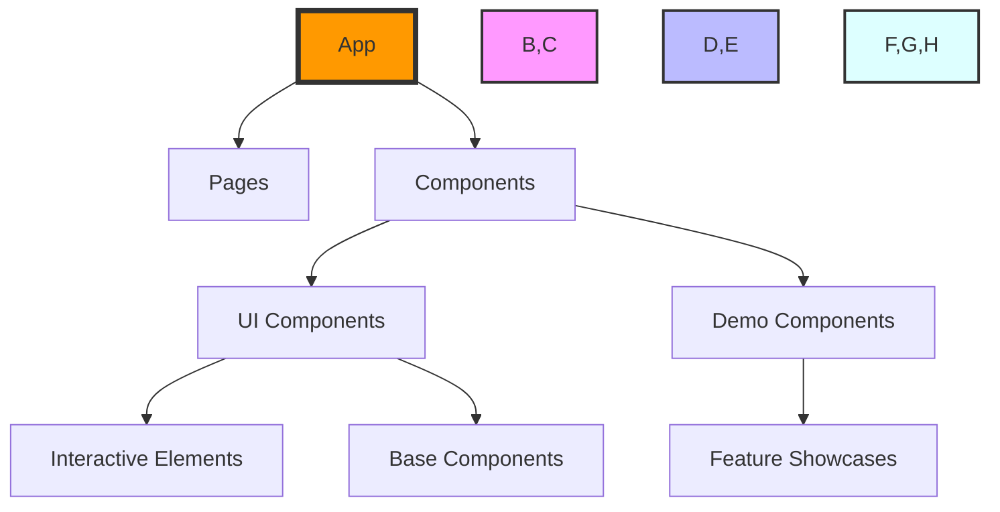

<div align="center">

# ✨ InteractiveUI Showcase


[](https://reactjs.org/)
[](https://www.typescriptlang.org/)
[](https://vitejs.dev/)
[](https://tailwindcss.com/)

*A modern collection of stunning UI components with fluid animations and interactive experiences*

[Live Demo](https://your-demo-link.com) • [Documentation](#documentation) • [Installation](#installation)

</div>

## ✨ Features

- 🎨 **Interactive Hero Section** - Captivating 3D rotations that respond to user interaction
- 🖼️ **Image Trail Effects** - Smooth image trails that follow cursor movement
- 🎠 **3D Photo Carousel** - Immersive photo viewing experience
- 🔄 **Logo Carousel** - Elegant brand showcase with smooth animations
- ⏳ **Timeline Component** - Interactive storytelling through visual timelines
- 🗺️ **World Map Integration** - Geographic data visualization with animations
- 📱 **Responsive Design** - Seamless experience across all devices
- ⚡ **Performance Optimized** - Smooth animations with minimal impact on performance

## 🎯 Why This Matters

Our project pushes the boundaries of web animations while maintaining performance and accessibility. We've solved complex challenges in:

- 3D transformations with optimal performance
- Cursor-based interactive animations
- Smooth state transitions
- Mobile-responsive 3D effects

## 🏗️ Architecture



## 🚀 Quick Start

1. **Clone and Install**
```bash
git clone https://github.com/yourusername/animated-hero-rotation.git
cd animated-hero-rotation
npm install
```

2. **Start Development Server**
```bash
npm run dev
```

3. **Build for Production**
```bash
npm run build
```

## 💻 Tech Stack

| Category | Technologies |
|----------|-------------|
| Frontend | React, TypeScript, Vite |
| Styling | TailwindCSS, Framer Motion |
| UI Components | Radix UI, Shadcn |
| Animation | Framer Motion, CSS Animations |
| State Management | React Hooks |
| Development | ESLint, PostCSS |

## 🎨 Interactive Components

Our project includes several highly interactive components:

### Hero Rotation
```typescript
// Example of our 3D rotation logic
const useMouseVector = (ref: RefObject<HTMLElement>) => {
  const [vector, setVector] = useState({ x: 0, y: 0 });
  // Advanced 3D transformation calculations
};
```

### Image Trail
- Smooth cursor following
- Dynamic image loading
- Performance-optimized animations

### 3D Photo Carousel
- Interactive 3D space navigation
- Smooth transitions
- Touch-friendly controls

## 📈 Performance

We've implemented several optimizations:
- Lazy loading of components
- RAF-based animations
- GPU-accelerated transforms
- Efficient state management

## 🛠️ Development

### Prerequisites
- Node.js 16+
- npm or yarn
- Modern web browser

### Environment Setup
1. Install dependencies
2. Configure environment variables
3. Start development server

## 🤝 Contributing

We welcome contributions! Here's how you can help:

1. Fork the repository
2. Create your feature branch
3. Commit your changes
4. Push to the branch
5. Open a Pull Request

## 📝 License

This project is licensed under the MIT License - see the [LICENSE](LICENSE) file for details.

## 🌟 Acknowledgments

- Framer Motion for animation capabilities
- Radix UI for accessible components
- Our amazing contributors

## 📫 Contact

For any inquiries or feedback, please open an issue or contact the maintainers.

---

<div align="center">
Made with ❤️ by developers for developers
</div>
